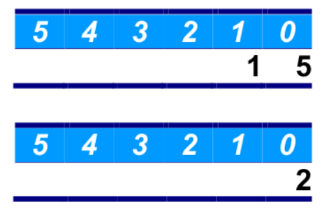
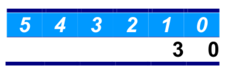

The exercise implements a method to multiply integer numbers using the addition operator (+) and not the
multiplication operator (x), storing the values in arrays. 

So, for example, to calculate “15 × 2” you will store these values in
two arrays to perform the operation:

The result will end in a third array as in :

